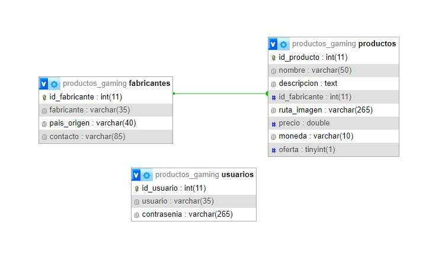

# Trabajo Practico Especial: WEB 2 2023

### Integrantes trabajo:
    - Lopez de Armentia, Santiago.
      - DNI: 37.014.604
      - Email: santiagolopezdearmentia2@gmail.com
      
    - Gigena, Maximiliano.
      - DNI: 33.356.983
      - Email: gigenamaximiliano2@gmail.com

### Temática:
  Ecommerce de productos gaming.

### Breve descripción:
  Venta de productos/componentes gaming como por ejemplo: perifericos en general (teclados, mouse, etc), consolas de video juegos, componentes para el armado de pc´s, notebooks, etc.
  
  Se contara con las siguientes tablas **[productos, fabricantes]**.

### Diagrama Entidad-Relacion

  

### Documentación API

## END Point's

### GET

1. URL: api/productos
  Devuelve todos los productos que se encuentren en la base de datos.

  Ejemplo response:
    ...json
    [
      {
        "id_producto": 34,
        "nombre": "Protector pantalla",
        "descripcion": "Aumenta la vida util del monitor.",
        "id_fabricante": 3,
        "ruta_imagen": "img_productos/default.png",
        "precio": 43650,
        "moneda": "ARG",
        "fabricante": "Gigabyte"
      }
      .
      .
      .
    ]
    ...

A su vez, este puede utilizarse con diferentes cadenas de consulta [Filtrado(filter), Ordenamiento(sort), Paginación(pagination)].

## Filtrado (filter)
  Filtrado se implementa utilizando los siguientes parámetros: api/productos?filter=[valor]&filterValue=[valor].

  | Parámetro | Tipo | Ejemplo | Descripción |
  |----------|----------|----------|----------|
  | filter    | String   | filter=nombre   | Valor nombre de la columna. Se realizara el filtro por la columna [nombre] de la tabla.|
  | filterValue    | String   | filterValue=Pad   | Valor de búsqueda. Se aplicara el filtro en la columna [nombre] por el valor [Pad]. |

## Ordenamiento (sort)
  Ordenamiento se implementa utilizando los siguientes parámetros: api/productos?sort=[valor]&order=[valor].

  | Parámetro | Tipo | Ejemplo | Descripción |
  |----------|----------|----------|----------|
  | sort    | String   | sort=nombre   | Valor nombre de la columna. Se realizara el ordenamientopor la columna [nombre] de la tabla.|
  | order    | String   | order=desc   | Valor de búsqueda. Se aplicara el ordenamiento en orden descendente. Posibles valores admitidos [asc/desc]. |

## Paginación (pagination)
  Paginación se implementa utilizando los siguientes parámetros: api/productos?page=[valor]&limit=[valor]

  | Parámetro | Tipo | Ejemplo | Descripción |
  |----------|----------|----------|----------|
  | page    | String   | page=2   | Número de página a mostrar.|
  | limit    | String   | limit=3   | Límite de elementos que se deberán mostrar. |

# Valores por defecto

  Cuando se hace uso de la cadena de parametro principal filter, sort, page y estos no toman ningun valor o no se encuentra el parámetro compañero, se toman los siguientes valores por defecto. Lo mismo aplica para los parametros secundarios.

  | Parámetro | Tipo | Ejemplo | Valor por defecto |
  |----------|----------|----------|----------|
  | filter    | String   | page   | nombre |
  | filterValue    | String   | page   |  |
  | sort    | String   | sort   | id_producto |
  | order    | String   | sort   | asc |
  | page    | String   | page  | 1 |
  | limit    | String   | page  | 3 |

La combinación de todos los parámetros se encuentra disponible. Ejemplo: api/productos?filter=[valor]&filterValue=[valor]&sort=[valor]&oder=[valor]&page=[valor]&limit=[valor].

2. URL: api/productos/:ID

  Devuelve un producto que se encuentren en la base de datos por el ID del mismo.

  Ejemplo request: 
    - api/productos/17

  Ejemplo response:
    Ejemplo response:
    ...json
    {
      "id_producto": 17,
      "nombre": "Protector pantalla",
      "descripcion": "Aumenta la vida util del monitor.",
      "id_fabricante": 3,
      "ruta_imagen": "img_productos/default.png",
      "precio": 43650,
      "moneda": "ARG",
      "fabricante": "Gigabyte"
    }
    ...

Adicional, se encuentra disponible la posibilidad de solicitar un subrecurso del producto.
  URL: api/productos/:ID/:subrecurso

  Ejemplo request:
    - api/productos/17/descripcion

  Ejemplo response:
    "Aumenta la vida util del monitor."

